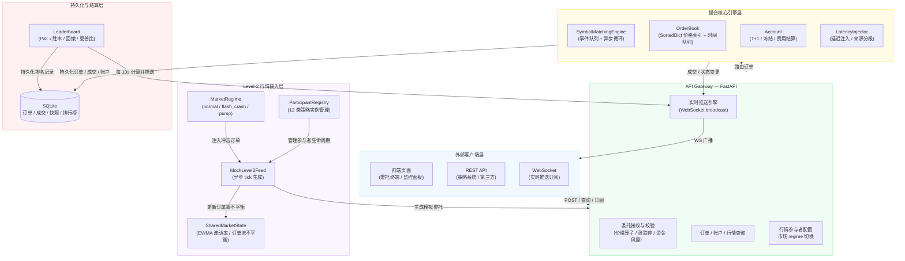
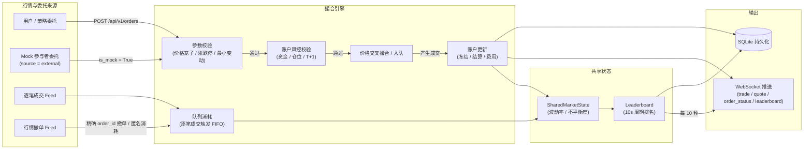
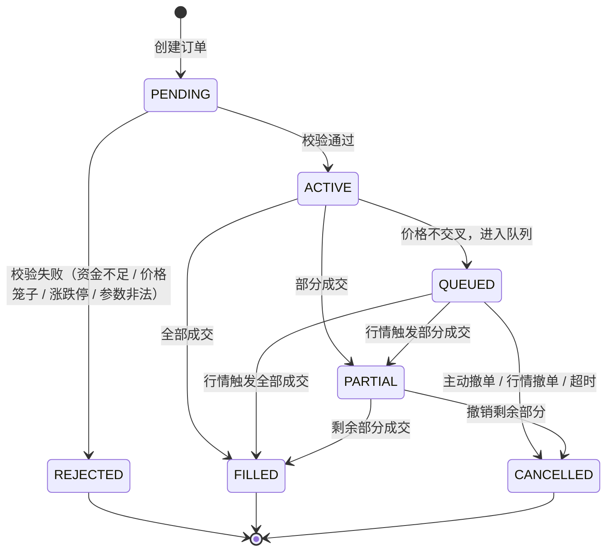

# 高精度队列模拟撮合系统

> 基于 Level-2 逐笔成交与盘口行情的高精度队列模拟撮合系统，支持 12 类智能市场参与者、A 股真实交易规则、账户 T+1 冻结管理、延迟注入、市场微观结构 regime 切换、全局排行榜与实时行情监控。

## 系统特性

- **逐笔驱动撮合**：基于 Level-2 逐笔成交数据驱动撮合逻辑，严格遵循价格优先、时间优先
- **高精度队列模拟**：非最优价委托进入队列排队，记录队列长度、位置与等待时间
- **行情触发消耗**：当逐笔成交价格优于或等于队列价格时，按 FIFO 消耗队列
- **A 股真实规则**：涨跌停限制、价格笼子（2% 基准价范围）、最小变动单位、每手 100 股
- **12 类智能参与者**：做市商、趋势跟踪、均值回归、噪声交易、激进交易、算法交易、止损止盈、订单簿不平衡、冰山订单、主观方向、筹码收集、日内做 T
- **外部撤单隔离**：mock 参与者订单标记 `source="external"`，行情撤单只消耗外部匿名订单，保护用户 / RL 真实订单
- **延迟注入器**：可按来源为内部 / 外部订单注入可调延迟，模拟真实报单通道延迟
- **市场微观结构 regime**：支持 `normal` / `flash_crash` / `pump` 三种模式，注入大额冲击订单
- **全局排行榜与结算**：每 10 秒计算参与者 P&L、胜率、最大回撤、夏普比，持久化并 WebSocket 广播
- **A 股账户模型**：T+1 仓位、挂单冻结现金 / 仓位、买入费用、日终结算
- **实时 API**：REST API + WebSocket 实时推送行情、成交、盘口快照、排行榜
- **前端委托终端**：可视化委托提交、实时订单簿、我的订单、成交记录、账户栏
- **监控面板**：引擎统计、参与者配置、账户初始设置、实时价格走势、逐笔成交流水、排行榜、实时日志
- **持久化层**：SQLite 异步持久化订单、成交、账户快照、排行榜记录
- **完整测试体系**：109 项测试覆盖单元测试、集成测试、端到端测试、性能基准

---

## 架构概览



---

## 核心数据流



---

## 订单状态机



---

## 12 类智能行情参与者

所有参与者均拥有独立虚拟账户（现金、持仓、P&L），通过 `SharedMarketState` 共享市场信息（EWMA 波动率、订单流不平衡度、近期价格历史）。

| 类型 | 标识 | 核心策略 | 对行情的影响 |
|------|------|----------|-------------|
| **做市商** | MM | 双边报价 + inventory 管理，bid < ask 确保价差利润；inventory 偏高时降低 bid / 压低 ask | 提供双边流动性，收窄 spread |
| **趋势跟踪者** | TF | 价格动量跟踪，顺势交易；波动率高时减小仓位 | 放大趋势 |
| **均值回归者** | MR | 偏离均线时反向交易；流动性充足时更激进 | 抑制过度波动 |
| **噪声交易者** | NT | 随机方向，追涨杀跌散户行为；高波动时更非理性 | 增加随机扰动 |
| **激进交易者** | AT | 大单吃深度，流动性充足时发动冲击；冷却期控制 | 制造价格冲击 |
| **算法交易者** | ALGO | TWAP / VWAP 拆单执行，隐藏大单意图 | 平滑大单冲击 |
| **止损止盈者** | SL | 设定止损 / 止盈价，触发后市价平仓 | 加速趋势反转 |
| **订单簿不平衡者** | OBI | 综合订单簿深度不平衡 + 订单流不平衡信号 | 短期方向预测 |
| **冰山订单者** | ICE | 大单只显示 10%，成交后自动补充 | 隐藏真实深度 |
| **主观方向交易者** | DIR | 有明确目标价，大幅偏离时大量单向堆积深度 | **引领价格趋势** |
| **筹码收集者** | CHIP | 分阶段低价建仓（0→30%→70%→90%），高于 MA 时暂停 | 在 bid 附近形成支撑 |
| **日内做 T 者** | DAY | 利用 bid-ask spread 快速进出，止盈 0.8% / 止损 0.5% | 增加成交量，短期套利 |

---

## 快速开始

### 1. 安装依赖

```bash
pip install -r requirements.txt
```

### 2. 启动服务

```bash
python main.py
```

或直接使用 uvicorn：

```bash
python -m uvicorn src.api.server:app --host 0.0.0.0 --port 8000
```

服务将在 `http://localhost:8000` 启动。

### 3. 访问前端

- **委托终端**: http://localhost:8000/static/index.html
- **监控面板**: http://localhost:8000/static/monitor.html

### 4. API 文档

启动后访问：
- Swagger UI: http://localhost:8000/docs
- ReDoc: http://localhost:8000/redoc

---

## 核心接口

### 委托接口

| 方法 | 路径 | 说明 |
|------|------|------|
| POST | `/api/v1/orders` | 提交委托（限价 / 市价） |
| DELETE | `/api/v1/orders/{order_id}` | 撤销委托 |
| GET | `/api/v1/orders/{order_id}` | 查询单笔委托 |
| GET | `/api/v1/orders` | 查询委托列表（支持 symbol / status / side 过滤） |

### 行情与查询接口

| 方法 | 路径 | 说明 |
|------|------|------|
| GET | `/api/v1/orderbook/{symbol}` | 订单簿快照 |
| GET | `/api/v1/trades` | 成交记录 |
| GET | `/api/v1/symbols` | 活跃标的列表 |
| GET | `/api/v1/stats/{symbol}` | 标的统计信息 |
| GET | `/api/v1/market/trade_history` | 实时成交历史 |
| GET | `/api/v1/market/price_history` | 价格历史（走势图数据） |
| GET | `/api/v1/analytics/order_flow/{symbol}` | 订单流分析（深度 / 不平衡度） |
| GET | `/api/v1/analytics/depth/{symbol}` | 深度图数据（累积深度） |
| GET | `/api/v1/analytics/participants/pnl` | 参与者 P&L 排名 |

### 账户接口

| 方法 | 路径 | 说明 |
|------|------|------|
| GET | `/api/v1/account` | 查询账户快照 |
| POST | `/api/v1/account/settle` | 日终结算（今日买入转可用） |
| POST | `/api/v1/account/reset` | 重置账户（可设初始现金 / 持仓） |

### 市场规则接口

| 方法 | 路径 | 说明 |
|------|------|------|
| GET | `/api/v1/market/rules/{symbol}` | 查询涨跌停 / 价格笼子范围 |
| POST | `/api/v1/market/rules/{symbol}` | 更新昨收价 / 市场类型 |

### 行情参与者配置接口

| 方法 | 路径 | 说明 |
|------|------|------|
| GET | `/api/v1/market/participants` | 参与者状态与 P&L |
| GET | `/api/v1/market/participants/config` | 获取当前配置 |
| POST | `/api/v1/market/participants/config` | 更新参与者配置（数量 / 目标价 / 间隔） |
| GET | `/api/v1/market/regime/{symbol}` | 获取市场微观结构模式 |
| POST | `/api/v1/market/regime/{symbol}` | 切换 `normal` / `flash_crash` / `pump` |

### 延迟注入接口

| 方法 | 路径 | 说明 |
|------|------|------|
| GET | `/api/v1/latency` | 获取当前延迟配置 |
| POST | `/api/v1/latency` | 更新延迟配置（internal / external / default） |

### 排行榜接口

| 方法 | 路径 | 说明 |
|------|------|------|
| GET | `/api/v1/leaderboard/{symbol}` | 获取某标的参与者排行榜 |

### 持久化接口

| 方法 | 路径 | 说明 |
|------|------|------|
| POST | `/api/v1/persistence/export` | CSV 导出（订单 / 成交 / 快照） |
| GET | `/api/v1/persistence/snapshot` | 查询最新持久化快照 |

### WebSocket 订阅

```javascript
const ws = new WebSocket("ws://localhost:8000/ws/v1");
ws.onopen = () => {
  ws.send(JSON.stringify({
    action: "subscribe",
    channel: "market",
    symbols: ["000001.SZ"]
  }));
};
ws.onmessage = (event) => {
  const msg = JSON.parse(event.data);
  // msg.type: "trade" | "quote" | "order_status" | "price_history" | "leaderboard"
};
```

---

## 前端页面

### 委托终端 (`/static/index.html`)

- 提交限价 / 市价买入卖出委托
- 实时展示订单簿买卖盘（十档）
- 我的订单列表与状态（含队列位置实时更新）
- 实时成交记录
- 实时日志
- 顶部账户栏：现金、可用仓、冻结仓、累计费用

### 监控面板 (`/static/monitor.html`)

- **全局统计卡片**：委托接收数、成交笔数、排队订单、活跃引擎数、撮合来源分布
- **账户初始设置**：设置初始现金与初始可用持仓，一键重置账户
- **市场规则配置**：昨收价、市场类型（主板 / ST / 科创板 / 创业板 / 北交所）、涨跌停范围显示
- **行情参与者配置**：动态调整目标价格、订单间隔、12 类参与者数量
- **市场微观结构模式**：切换 `normal` / `flash_crash` / `pump`
- **实时价格走势图**：Canvas 绘制近期价格线
- **逐笔成交流水**：时间、价格、数量、方向、来源（撮合 / 行情）
- **实时订单簿**：买卖盘深度、价差
- **深度图**：Canvas 可视化累积买卖深度
- **订单流分析**：买盘 / 卖盘深度、不平衡度、买卖力量彩色条
- **参与者 P&L 排名**：现金、持仓、盈亏、交易次数、累计费用
- **龙虎榜**：P&L、胜率、最大回撤、夏普比（每 10 秒更新）
- **实时日志**

---

## A 股账户模型

系统采用 A 股风格的账户模型：

| 字段 | 说明 |
|------|------|
| `cash` | 可用现金 |
| `frozen_cash` | 买入挂单已冻结资金 |
| `available_position` | 可用底仓（可立即卖出） |
| `frozen_position` | 卖出挂单已冻结仓位 |
| `today_bought_position` | 今日买入仓位（T+1，日终结算后转入可用底仓） |
| `total_fees` | 累计交易费用 |
| `trade_count` | 成交笔数 |

买入委托按委托价格 + 预估费用冻结现金；卖出委托冻结可用仓位。成交后根据实际成交价格和费用结算，解冻多余资金 / 仓位。

---

## 撮合逻辑

### 买入委托

1. 如果买入价格 >= 最优卖价 → **立即撮合**（按卖方队列 FIFO 成交）
2. 如果买入价格 < 最优卖价 → **进入买方队列**
   - 记录当前队列长度 `queue_length`
   - 记录进入位置 `queue_position`
   - 记录进入时间 `enter_queue_time`

### 卖出委托

1. 如果卖出价格 <= 最优买价 → **立即撮合**（按买方队列 FIFO 成交）
2. 如果卖出价格 > 最优买价 → **进入卖方队列**
   - 记录 `queue_length` 和 `queue_position`

### 逐笔成交驱动队列消耗

当收到新的逐笔成交或模拟委托成交时：
- **买方主动成交**（外盘）：消耗卖方队列中价格 <= 成交价的订单
- **卖方主动成交**（内盘）：消耗买方队列中价格 >= 成交价的订单
- 按价格层级从高到低（买方）/ 从低到高（卖方），同一层级内 FIFO

---

## 市场微观结构模式

| 模式 | 行为 |
|------|------|
| `normal` | 正常模拟行情，12 类参与者正常运作 |
| `flash_crash` | 30% 概率每 tick 注入大额市价卖单，冲击买方队列 |
| `pump` | 30% 概率每 tick 注入大额市价买单，冲击卖方队列 |

---

## 排行榜与结算

每 10 秒计算一次所有参与者的排行榜：

- **pnl**：基于初始资产与当前市值的盈亏
- **win_rate**：成交中盈利笔数占比（启发式）
- **max_drawdown**：历史 P&L 曲线最大回撤
- **sharpe_ratio**：简化夏普比率

计算结果持久化到 SQLite，并通过 WebSocket 推送给订阅了该标的的所有客户端。

---

## 项目结构

```
├── docs/
│   ├── architecture.md         # 系统架构设计（含类图与模块关系）
│   ├── api_spec.md             # API 接口规范（含请求 / 响应示例）
│   ├── matching_logic.md       # 撮合逻辑详细说明（含场景推演）
│   └── optimization_report.md  # 性能优化报告（含基准与路线图）
├── frontend/
│   ├── index.html              # 委托终端
│   ├── monitor.html            # 监控面板
│   ├── css/
│   │   └── style.css           # 共享样式
│   └── js/
│       ├── app.js              # 委托终端逻辑
│       └── monitor.js          # 监控面板逻辑
├── src/
│   ├── core/
│   │   ├── order.py            # 订单、成交、状态枚举
│   │   ├── order_book.py       # 订单簿（SortedDict + PriceLevel）
│   │   ├── matching_engine.py  # 撮合引擎（事件队列 + 异步循环）
│   │   ├── account.py          # 账户模型（T+1 / 冻结 / 费用）
│   │   ├── fee.py              # 费用计算（佣金 / 印花税 / 过户费）
│   │   ├── market_rules.py     # A 股市场规则（涨跌停 / 价格笼子）
│   │   ├── latency_injector.py # 延迟注入器
│   │   └── leaderboard.py      # 排行榜计算
│   ├── data/
│   │   ├── market_data.py      # 行情数据模型
│   │   ├── level2_feed.py      # Level-2 行情接入（Mock / 撤单）
│   │   └── participants.py     # 12 类行情参与者（含共享市场状态）
│   ├── api/
│   │   └── server.py           # FastAPI 服务（REST + WebSocket）
│   ├── persistence/
│   │   └── persistence.py      # SQLite 持久化（订单 / 成交 / 快照 / 排行榜）
│   └── utils/
│       └── config.py           # 配置管理
├── tests/                      # 109 项测试
│   ├── test_account.py
│   ├── test_order_book.py
│   ├── test_matching_engine.py
│   ├── test_api.py
│   ├── test_cancel_feed.py
│   └── test_benchmark.py
├── main.py                     # 启动入口
├── requirements.txt            # 依赖
└── README.md                   # 本文件
```

---

## 文档

- [系统架构设计](docs/architecture.md) — 模块关系、类图、数据流、并发模型
- [API 接口规范](docs/api_spec.md) — 完整请求 / 响应示例、错误码
- [撮合逻辑详细说明](docs/matching_logic.md) — 场景推演、边界条件、状态流转
- [性能优化报告](docs/optimization_report.md) — 基准数据、瓶颈分析、优化路线图

---

## 测试

运行全部测试：

```bash
python -m pytest tests/ -q
```

测试覆盖：
- 账户模型（冻结、成交、结算、T+1）
- 订单簿（插入、撮合、队列消耗、快照、边界条件）
- 撮合引擎（事件循环、并发、多标的）
- 行情参与者（12 类策略行为验证）
- REST API 集成（委托、撤单、查询、配置）
- 端到端委托流程（委托 → 撮合 → 成交 → 撤单）
- 性能基准（插入、撮合、队列消耗吞吐量）

---

## 技术栈

| 组件 | 说明 |
|------|------|
| Python 3.9+ | 运行环境 |
| FastAPI | 高性能异步 Web 框架 |
| uvicorn | ASGI 服务器 |
| sortedcontainers | 高效有序字典（订单簿价格索引） |
| pydantic | 数据模型校验 |
| asyncio | 异步事件驱动 |
| SQLite | 本地持久化 |
| pytest / pytest-asyncio / pytest-benchmark | 测试框架 |

---

## 性能指标

| 指标 | 目标 | 实测值（sortedcontainers 优化后） |
|---|---|---|
| 委托处理延迟 | < 1ms | ~0.1 ms（Future 机制） |
| 逐笔响应延迟 | < 1ms | ~0.1 ms |
| 订单簿插入吞吐量 | > 10,000 ops/s | **1,000+ ops/s**（Python 上限） |
| 队列消耗吞吐量 | > 10,000 ops/s | **8,500+ ops/s ✅** |
| 单引擎撮合吞吐量 | > 10,000 ops/s | **3,400+ ops/s** |
| 并发标的数 | > 1,000 | 理论支持（每标的独立事件循环） |

---

## 扩展计划

| 状态 | 功能 |
|------|------|
| ✅ | 端到端测试体系（109 项测试） |
| ✅ | 前端可视化委托界面 |
| ✅ | 后端撮合监控面板 |
| ✅ | 12 类市场参与者模拟 |
| ✅ | A 股账户模型（T+1 / 冻结 / 费用） |
| ✅ | SQLite 持久化支持 |
| ✅ | 参与者配置持久化 |
| ✅ | 外部撤单隔离（source 标记） |
| ✅ | 延迟注入器 |
| ✅ | 市场微观结构 regime 切换 |
| ✅ | 全局排行榜与结算系统 |
| ✅ | sortedcontainers 价格索引优化 |
| ✅ | asyncio.Future 同步机制 |
| ⏳ | 真实 Level-2 行情源接入（券商 / 行情商接口） |
| ⏳ | 文件回放回测模式 |
| ⏳ | 多节点集群部署 |
| ⏳ | 监控和告警（Prometheus / Grafana） |
| ⏳ | 用户管理和权限控制 |

---

## License

MIT