# 系统架构设计文档

> 本文档描述高精度队列模拟撮合系统的整体架构、核心模块关系、数据流与并发模型。

---

## 1. 系统概述

本系统是一个基于 **Level-2 逐笔成交与盘口行情** 的高精度队列模拟撮合系统，核心设计目标：

1. **逐笔级精度**：每个逐笔成交事件触发一次队列扫描，精确模拟 FIFO 消耗
2. **价格优先 + 时间优先**：严格遵循交易所撮合规则
3. **队列透明化**：记录进入位置、队列长度、等待时间，支持策略分析
4. **A 股真实规则**：涨跌停、价格笼子、最小变动、T+1 冻结、费用模型
5. **智能行情模拟**：12 类参与者独立策略、虚拟账户、共享市场状态
6. **实时可观测**：REST API + WebSocket 实时推送，前端可视化监控

---

## 2. 整体架构

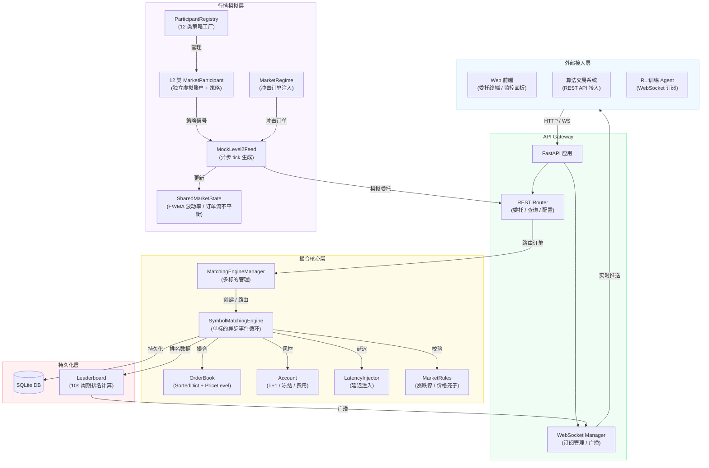

---

## 3. 核心模块类图

### 3.1 订单与成交模型

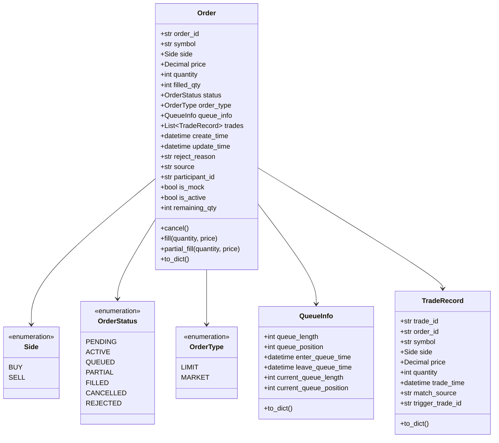

### 3.2 订单簿

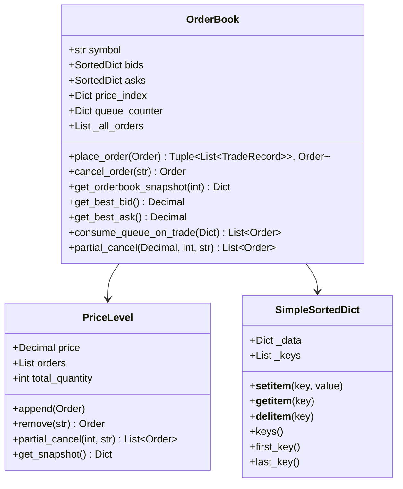

### 3.3 撮合引擎

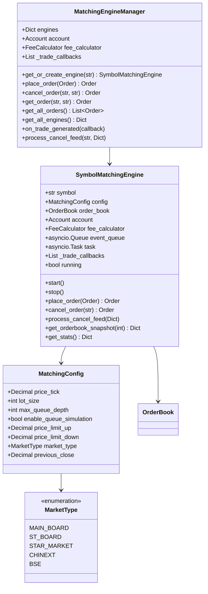

### 3.4 账户与费用

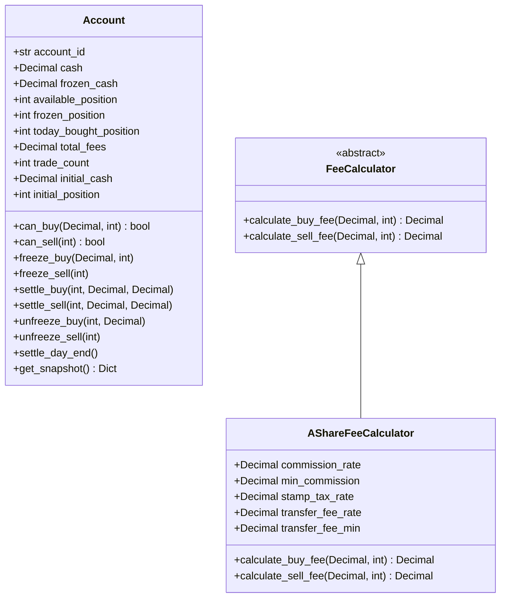

### 3.5 市场规则

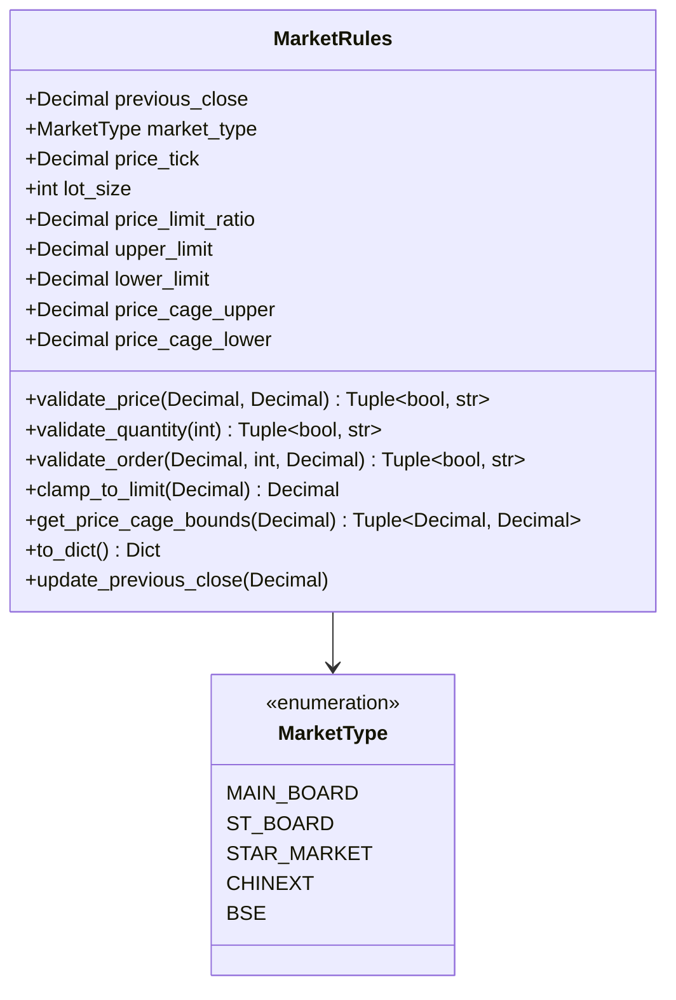

### 3.6 行情参与者

```mermaid
classDiagram
    class MarketParticipant {
        <<abstract>>
        +str participant_id
        +str symbol
        +Decimal base_price
        +Decimal target_price
        +float order_interval
        +bool active
        +Decimal cash
        +int position
        +Decimal total_fees
        +int total_trades
        +List _pending_orders
        +generate_order(Dict) Dict
        +generate_cancel(Dict) Dict
        +on_order_filled(str, Dict)
        +on_order_queued(Dict)
        +get_stats() Dict
    }

    class MarketMaker {
        +Decimal base_spread
        +Decimal inventory_skew
        +int max_inventory
        +generate_order(Dict) Dict
    }

    class TrendFollower {
        +int window_size
        +Decimal momentum_threshold
        +generate_order(Dict) Dict
    }

    class MeanReversionTrader {
        +int ma_window
        +Decimal deviation_threshold
        +generate_order(Dict) Dict
    }

    class NoiseTrader {
        +float irrational_prob
        +float cancel_prob
        +generate_order(Dict) Dict
    }

    class AggressiveTrader {
        +float burst_prob
        +int min_depth
        +int cooldown
        +generate_order(Dict) Dict
    }

    class AlgorithmicTrader {
        +str algo_type
        +int slice_count
        +generate_order(Dict) Dict
    }

    class StopLossTrader {
        +Decimal stop_loss_pct
        +Decimal take_profit_pct
        +generate_order(Dict) Dict
    }

    class OrderBookImbalanceTrader {
        +float imbalance_threshold
        +generate_order(Dict) Dict
    }

    class IcebergParticipant {
        +float visible_ratio
        +generate_order(Dict) Dict
    }

    class DirectionalTrader {
        +Decimal urgency
        +int max_position
        +generate_order(Dict) Dict
    }

    class ChipCollector {
        +int target_position
        +generate_order(Dict) Dict
    }

    class DayTrader {
        +int max_holding_ticks
        +Decimal stop_loss_pct
        +Decimal profit_target_pct
        +generate_order(Dict) Dict
    }

    class ParticipantRegistry {
        +Dict _participants
        +Dict _config
        +build_default_participants()
        +update_config(Dict)
        +get_all_stats() List~Dict~
    }

    class SharedMarketState {
        +List last_trades
        +List price_history
        +Decimal volatility_ewma
        +float order_flow_imbalance
        +on_trade(Dict)
        +on_book_update(Dict)
    }

    MarketParticipant <|-- MarketMaker
    MarketParticipant <|-- TrendFollower
    MarketParticipant <|-- MeanReversionTrader
    MarketParticipant <|-- NoiseTrader
    MarketParticipant <|-- AggressiveTrader
    MarketParticipant <|-- AlgorithmicTrader
    MarketParticipant <|-- StopLossTrader
    MarketParticipant <|-- OrderBookImbalanceTrader
    MarketParticipant <|-- IcebergParticipant
    MarketParticipant <|-- DirectionalTrader
    MarketParticipant <|-- ChipCollector
    MarketParticipant <|-- DayTrader
    ParticipantRegistry --> MarketParticipant
    MarketParticipant --> SharedMarketState
```

---

## 4. 数据流设计

### 4.1 委托下单全流程

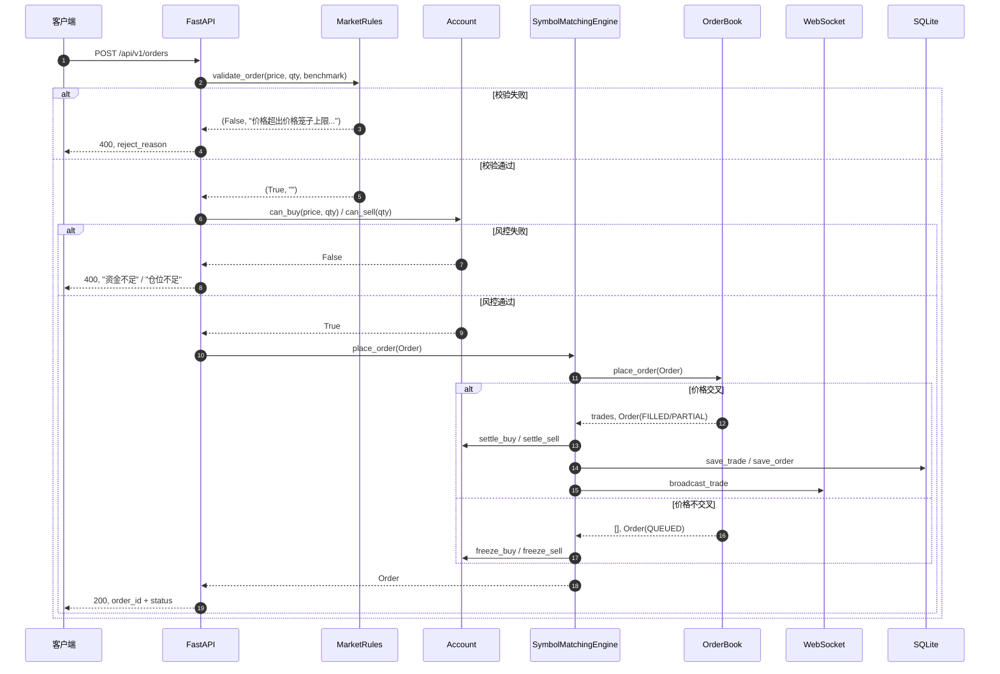

### 4.2 逐笔成交驱动队列消耗

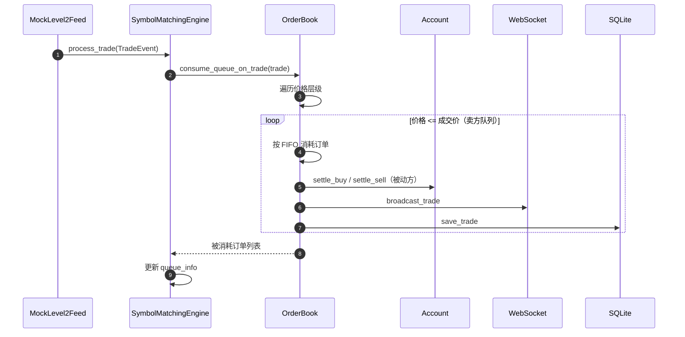

### 4.3 行情生成与参与者交互

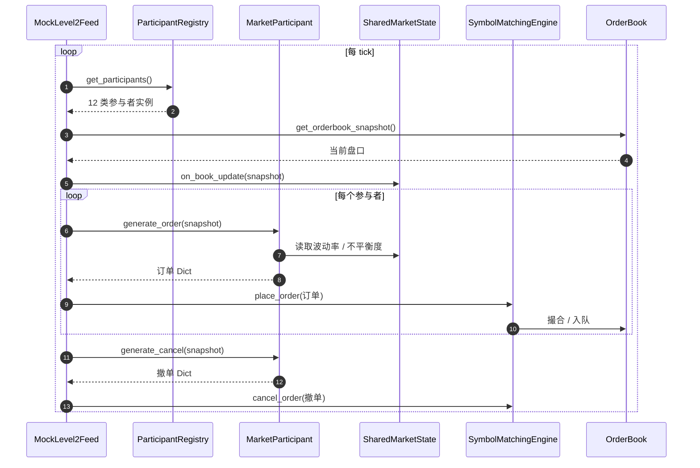

---

## 5. 并发模型

### 5.1 单标的串行处理

每个标的拥有独立的 `SymbolMatchingEngine`，内部使用 `asyncio.Queue` + `asyncio.Task` 实现单线程事件循环：

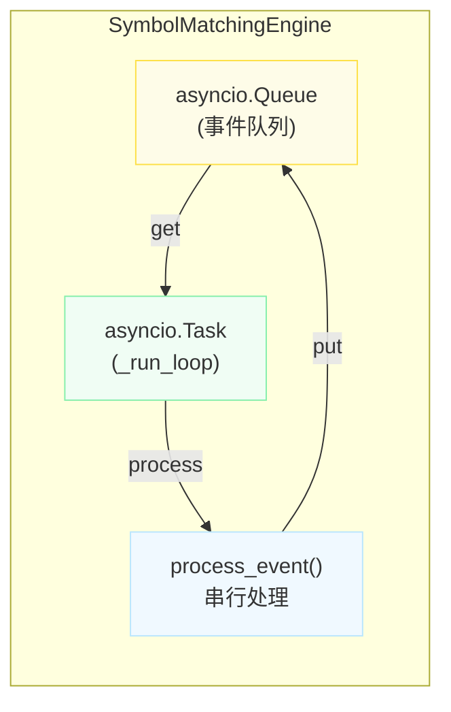

事件类型：
- `order`: 新委托
- `cancel`: 撤单
- `trade`: 逐笔成交（驱动队列消耗）
- `cancel_feed`: 行情撤单

### 5.2 跨标的并行处理

不同标的之间完全独立，由 `MatchingEngineManager` 路由：

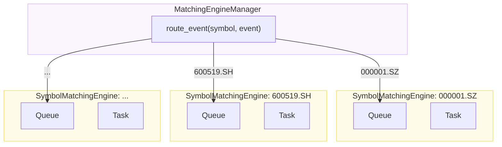

### 5.3 同步机制

`place_order` 使用 `asyncio.Future` 实现真正的异步等待（非轮询）：

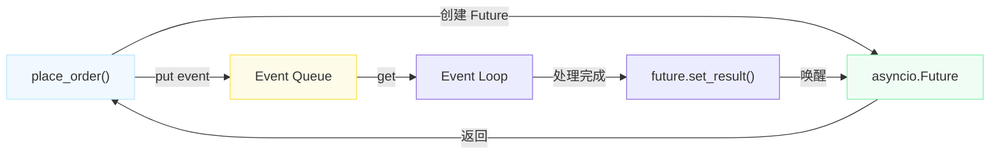

---

## 6. 配置设计

```yaml
engine:
  symbols:
    - "000001.SZ"
    - "600519.SH"

  level2_feed:
    source: "mock"  # mock / tencent / sina / custom
    trade_topic: "trade"
    quote_topic: "quote"

  matching:
    price_tick: 0.01          # 最小价格变动单位
    lot_size: 100             # 最小交易单位
    max_queue_depth: 10000    # 最大队列深度

  market_rules:
    previous_close: 10.50     # 昨收价
    market_type: "main_board" # main_board / st_board / star_market / chinext / bse

  latency:
    default_ms: 0
    internal_ms: 0
    external_ms: 0

  api:
    host: "0.0.0.0"
    port: 8000

  logging:
    level: "INFO"
    format: "json"
```

---

## 7. 扩展性设计

| 扩展点 | 方案 | 状态 |
|--------|------|------|
| 新标的接入 | 动态创建 SymbolMatchingEngine，无需重启 | ✅ 已实现 |
| 新行情源 | 实现 Level2FeedHandler 接口 | ⏳ 预留 |
| 新参与者类型 | 继承 MarketParticipant，注册到 ParticipantRegistry | ✅ 已实现 |
| 持久化后端 | 当前 SQLite，可扩展 Redis / PostgreSQL | ⏳ 预留 |
| 集群部署 | 通过消息队列（Kafka / RabbitMQ）分发行情 | ⏳ 预留 |
| 监控告警 | Prometheus / Grafana 指标暴露 | ⏳ 预留 |
